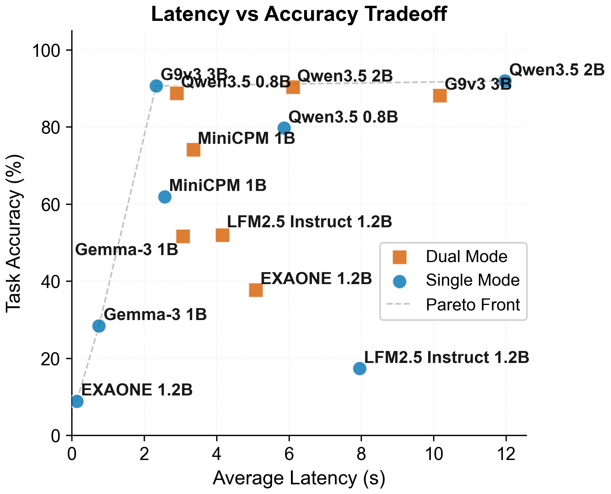
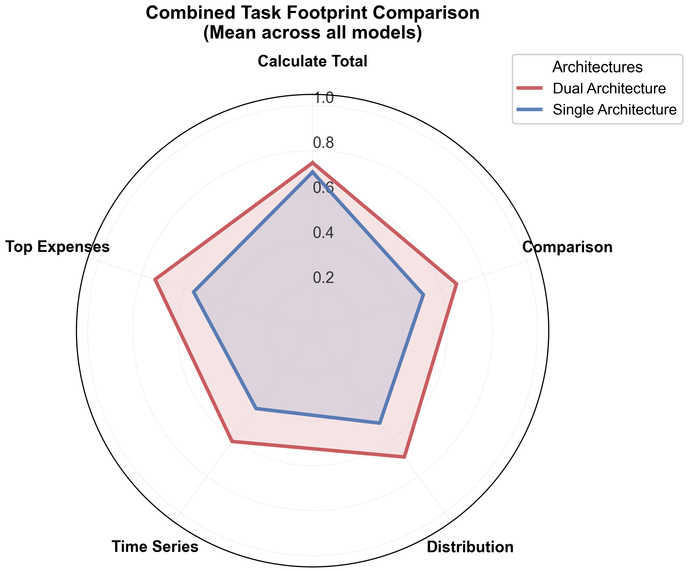
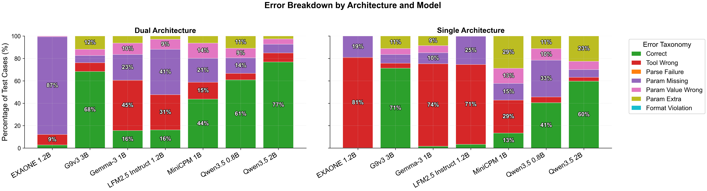
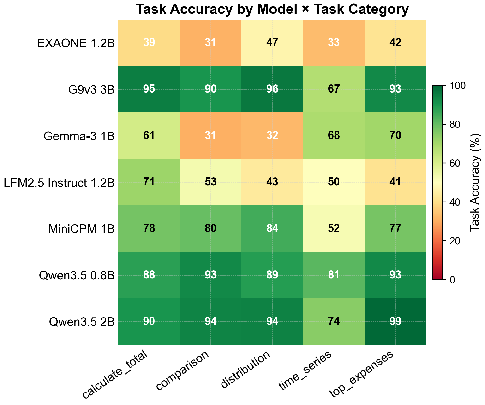
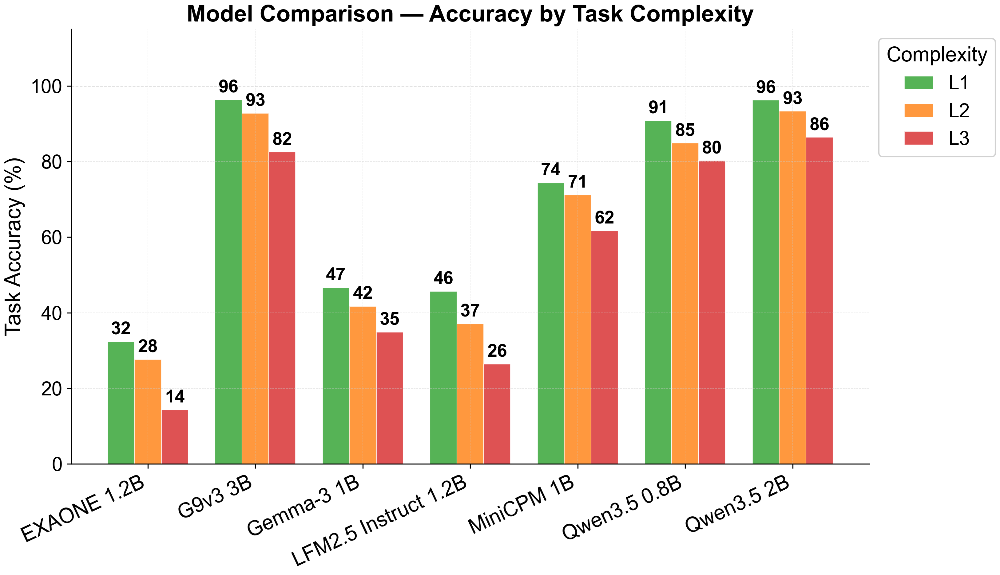
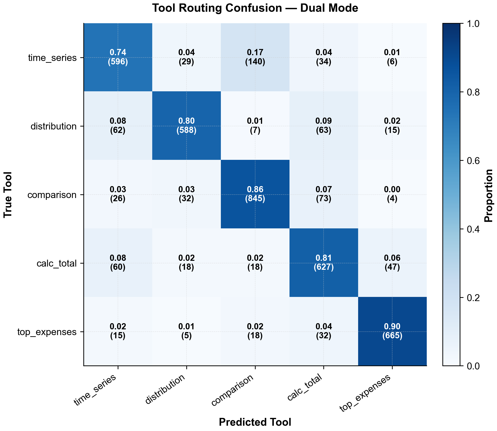
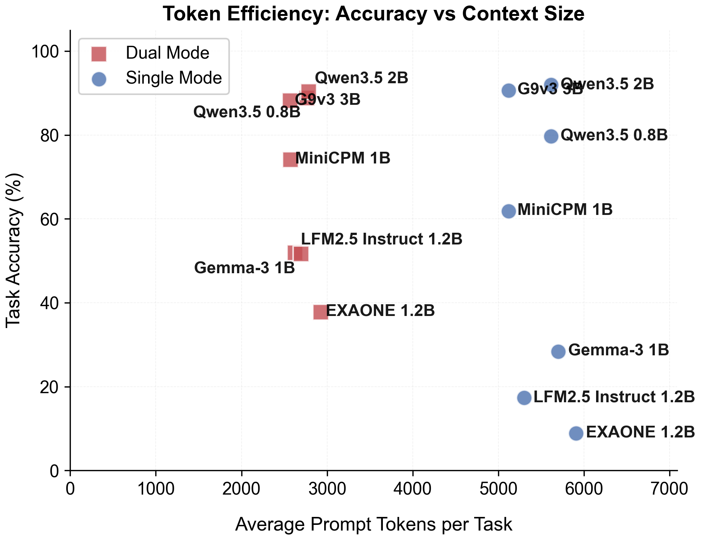

# SpendSight: Privacy-Preserving Personal Finance Q&A with Sub-2B LLMs

> **Accepted at The 11th Workshop on Financial Technology and Natural Language Processing (FinNLP 2026 @ EMNLP 2026)**  
> *Sajag Swami, Yash Pandey* — Independent Researchers  
---

## Why SpendSight?

Personal finance queries like *"compare my restaurant spending Jan–Jun 2025 vs Jul–Dec 2025"* require structured tool calls with precise parameter extraction. When sent to cloud APIs, they expose sensitive financial behavior patterns.

**SpendSight** is a comprehensive benchmark evaluating whether quantized sub-2B LLMs running **entirely on consumer hardware** (8 GB Apple Silicon) can reliably execute these tool calls—with **zero data leaving the device**. We evaluate **7 models** across **two architectures** (single-agent vs. dual-agent) with **8,050 total observations**.

---

## Visual Insights & Benchmark Findings

### Latency vs. Accuracy Tradeoff
Dual-agent Qwen3.5-0.8B dominates the efficiency frontier: 89% Task Accuracy at just 3 seconds on-device.



---

### Functional Footprint & Tool Coverage
Multi-dimensional evaluation across Function Selection, Argument Completeness, Argument Value Correctness, and strict Exact Matches:



---

### Error Taxonomy & Safety Profile
Dual-agent decomposition suppresses dangerous `PARAM_EXTRA` hallucinations (silently wrong financial analytics) in favor of safer `PARAM_MISSING` omissions:



---

### Category Performance & Difficulty Tier Breakdown
Performance across 5 tool groups and 3 complexity tiers (L1 simple → L3 complex cross-year comparisons):

<p align="center">
  
  
</p>

---

### Tool Routing & Token Efficiency
The router achieves high classification precision while the dual-agent architecture processes fewer tokens per query:

<p align="center">
  
  
</p>

---

## Key Results

| Model | Mode | Task Acc | CR | FSP | Latency | RAM |
|---|---|---|---|---|---|---|
| Qwen3.5-0.8B | Dual | 89.1% | 61.7% | 94.3% | 3.0 s | 1.2 GB |
| **Qwen3.5-2B** | **Dual** | **90.4%** | **77.6%** | 92.0% | 6.2 s | 2.1 GB |
| G9v3-3B† | Single | 90.6% | 71.7% | 95.7% | 2.3 s | 2.4 GB |
| MiniCPM5-1B | Dual | 74.1% | 43.8% | 84.9% | 3.9 s | 1.5 GB |
| LFM2.5-1.2B | Dual | 51.9% | 16.2% | 68.5% | 4.1 s | 1.4 GB |
| Gemma-3-1B-it | Dual | 51.6% | 16.5% | 55.1% | 3.1 s | 1.5 GB |
| EXAONE-4.0-1.2B | Dual | 37.8% | 2.8% | 90.6% | 5.0 s | 1.9 GB |

†G9v3-3B (Q4_K_M) included as a 3B reference; all other models use Q8_0.

Full raw data → [`backend/benchmark_outputs/`](backend/benchmark_outputs/)

---

## Models Evaluated

| Model | Family | Params | Quant | RAM |
|---|---|---|---|---|
| EXAONE-4.0-1.2B | EXAONE-4.0 | 1.2B | Q8_0 | 2.0 GB |
| Gemma-3-1B-it | Gemma-3 | 1B | Q8_0 | 1.6 GB |
| LFM2.5-1.2B | LFM2.5 | 1.2B | Q8_0 | 1.4 GB |
| MiniCPM5-1B | MiniCPM5 | 1B | Q8_0 | 1.5 GB |
| Qwen3.5-0.8B | Qwen3.5 | 0.8B | Q8_0 | 1.3 GB |
| Qwen3.5-2B | Qwen3.5 | 2B | Q8_0 | 2.1 GB |
| G9v3-3B† | G9v3 | 3B | Q4_K_M | 2.4 GB |

All models run via [llama.cpp](https://github.com/ggerganov/llama.cpp) with full GPU offload on Apple Metal.

---

## Repository Structure

```
.
├── README.md                          # Documentation & reproduction guide
├── requirements.txt                   # Python package dependencies
├── LICENSE                            # MIT License
└── backend/
    ├── experiments/
    │   ├── expense_benchmark.py       # Main benchmarking runner (single & dual agent)
    │   ├── analyze_plot_benchmarks.py # Publication-quality plot generation
    │   ├── camera_ready_analysis.py   # Camera-ready table generation & bootstrap CIs
    │   ├── embedding_baseline.py      # Embedding-similarity baseline
    │   ├── test_cases.py              # 115 benchmark test cases & complexity scoring
    │   ├── inference.py               # Unified LlamaCpp inference dispatch & KV cleanup
    │   ├── models.py                  # Model registry for sub-2B SLMs
    │   └── memory.py                  # Memory management for on-device execution
    ├── utils/
    │   ├── tool_registry.py           # Canonical tool ID (1–5) to name mappings
    │   ├── tool_prompts.py            # Specialist prompt templates & few-shot examples
    │   ├── llm_input_validation.py    # Post-hoc parameter validation & fuzzy matching
    │   ├── categories.json            # Known expense categories & hierarchical mapping
    │   └── prompts/
    │       └── router_prompt.txt      # Intent classification prompt for router
    └── benchmark_outputs/
        ├── run_5reps_combined.csv     # Full raw benchmark dataset (8,050 observations)
        ├── run_5reps_dual.csv         # Dual-agent raw observations
        ├── run_5reps_single.csv       # Single-agent raw observations
        ├── camera_ready_outputs/      # Pre-computed bootstrap CIs, per-group/tier CSVs
        └── figures/                   # Publication figures (30 PNGs)
```

---

## Getting Started

### 1. Environment Setup

```bash
# Clone the repository
git clone https://github.com/SunTzunami/SpendSight-benchmark.git
cd SpendSight-benchmark

# Create and activate virtual environment
python3 -m venv venv
source venv/bin/activate

# Install dependencies
pip install -r requirements.txt
```

For Apple Silicon GPU acceleration (Metal):
```bash
CMAKE_ARGS="-DGGML_METAL=on" pip install --upgrade --force-reinstall llama-cpp-python --no-cache-dir
```

---

### 2. Download Model Weights

Models evaluated use public GGUF quantizations. Download to `backend/models/`:

```bash
pip install huggingface_hub
mkdir -p backend/models

huggingface-cli download LGAI-EXAONE/EXAONE-4.0-1.2B-GGUF EXAONE-4.0-1.2B-Q8_0.gguf --local-dir backend/models/
huggingface-cli download ggml-org/gemma-3-1b-it-GGUF gemma-3-1b-it-Q8_0.gguf --local-dir backend/models/
huggingface-cli download LiquidAI/LFM2.5-1.2B-Instruct-GGUF LFM2.5-1.2B-Instruct-Q8_0.gguf --local-dir backend/models/
huggingface-cli download Abiray/MiniCPM5-1B-GGUF minicpm5-1b-Q8_0.gguf --local-dir backend/models/
huggingface-cli download unsloth/Qwen3.5-0.8B-GGUF Qwen3.5-0.8B-Q8_0.gguf --local-dir backend/models/
huggingface-cli download unsloth/Qwen3.5-2B-GGUF Qwen3.5-2B-Q8_0.gguf --local-dir backend/models/

# 3B reference model (Q4_K_M quantization)
huggingface-cli download ai9stars/G9v3-3B ai9stars_G9v3-3B-Q4_K_M.gguf --local-dir backend/models/
```

---

### 3. Running Benchmarks

From the `backend/` directory:

```bash
cd backend

# Run complete benchmark (Single & Dual Agent, 5 Repetitions)
python experiments/expense_benchmark.py --mode both --reps 5 --output-dir benchmark_outputs --basename run_5reps

# Run quick test on a single model (1 Repetition)
python experiments/expense_benchmark.py --mode dual --models Qwen3.5-2B-Q8_0.gguf --quick

# Run embedding classifier baseline
python experiments/embedding_baseline.py
```

---

### 4. Regenerating Figures & Tables

```bash
cd backend

# Generate full figure suite
python experiments/analyze_plot_benchmarks.py \
    --input benchmark_outputs/run_5reps_combined.csv \
    --output benchmark_outputs/figures/

# Generate camera-ready tables and bootstrap CIs
python experiments/camera_ready_analysis.py \
    --input benchmark_outputs/run_5reps_combined.csv \
    --output benchmark_outputs/camera_ready_outputs/
```

---

## Citation

If you find SpendSight useful in your research, please cite:

```bibtex
@inproceedings{swami2026spendsight,
  title     = {{SpendSight}: Privacy-Preserving Personal Finance {Q\&A} with Sub-2{B} {LLMs}},
  author    = {Swami, Sajag and Pandey, Yash},
  booktitle = {Proceedings of the 11th Workshop on Financial Technology and Natural Language Processing (FinNLP 2026)},
  year      = {2026}
}
```

See also our earlier workshop paper:
```bibtex
@inproceedings{swami2026expensesense,
  title     = {{ExpenseSense}: Privacy-Preserving On-Device Personal Finance Tool Calling with Sub-2B {LLMs}},
  author    = {Swami, Sajag and Pandey, Yash},
  booktitle = {2nd Workshop on Human-Centered Privacy and Security for Language Models (HAIPS @ COLM 2026)},
  year      = {2026},
  note      = {Non-archival workshop paper}
}
```

---

## License

This project is licensed under the [MIT License](LICENSE).
